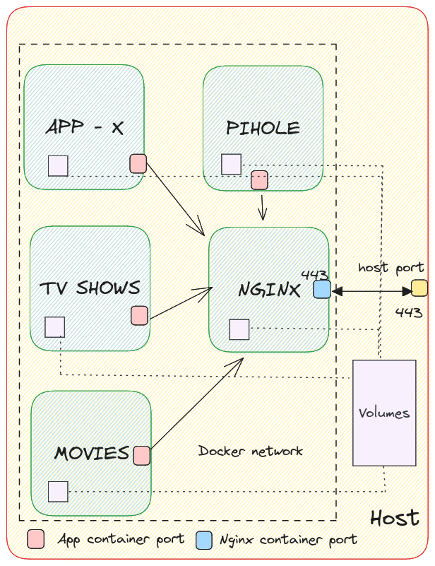

# Home Lab #

## All app configurations ##

| App                                                       | Url                                        | Description                |
|-----------------------------------------------------------|--------------------------------------------|----------------------------|
| [Nginx](https://nginx.org/en/)                            | NA                                         | Reverse proxy for all apps |
| [Homepage](https://github.com/benphelps/homepage)         | https://dash.home                          | Dashboard                  |
| [Pihole](https://pi-hole.net/)                            | https://dns.home/admin                     | DNS Management             |
| [Excalidraw](https://excalidraw.com)                      | https://draw.home                          | Diagramming tool           |
| [Portainer](https://www.portainer.io)                     | https://docker.home                        | Docker containers UI       |
| [Vaultwarden](https://github.com/dani-garcia/vaultwarden) | https://vault.home                         | Password manager           |
| [Prowlarr](https://prowlarr.com/)                         | https://indexer.home                       | Torrent indexer            |
| [Transmission](https://transmissionbt.com/)               | https://torrent.home                       | Torrent client             |
| [Sonarr](https://sonarr.tv/)                              | https://series.home                        | TV show monitoring         |
| [Radarr](https://radarr.video/)                           | https://movies.home                        | Movie monitoring           |
| [Bazarr](https://www.bazarr.media/)                       | https://subtitles.home                     | Subtitles monitoring       |
| [Jellyfin](https://jellyfin.org/)                         | https://entertainment.home, http://IP:8096 | Media server               |
| [Ombi](https://ombi.io/)                                  | https://request.home                       | Request movies / TV shows  |

## Network ##

All containers in the `docker-compose.yml` file would share the same network. All the containers are addressible by the `container_name` hostname as it appears in the docker compose configuration file.



## DNS Resolution ##

In `etc/resolv.conf` on the host machine, add an additional nameserver pointing to `127.0.0.1`.

```
nameserver 127.0.0.1 #pihole
nameserver 8.8.8.8
```

- By default, pihole will be consulted as the dns for your system. If it fails, then your default nameservers will be used.
- For the docker containers, pihole will still be used as a dns solution because by default the host system's dns resolver is used.
- Under `Local DNS` setup a DNS pointing to `127.0.0.1` for `home`.
- For every service that needs to be exposed, create a CNAME record, pointing to `home`. Example, create a CNAME `draw.home` pointing to `home`, and configure proxy pass for the port `5000` of the docker host `excalidraw` for the domain `draw.home` in nginx. Do not use `home` subdomains inside nginx or any docker container as it would always resolve to localhost.
- Note the `CORS_HOSTS` mapping in the docker compose configuration. This should point to the `dns.home` to notify the container of additional hosts serving the container.
- The DNS A record configurations are at `pihole/custom.list`.
- The CNAME configurations are at `pihole/05-pihole-custom-cname.conf`.
- These are volume mounted. After changing these, restart the container.

## Nginx Reverse proxy ##

- The additional configurations are present at `nginx/nginx.conf`. This is volume mounted. A change here requires restart of the nginx container.

#### Self signed certificate ####

- Create and install a self signed certificate on the nginx container. The public key of this certificate should be installed by the hosts using the homelab.
- To generate the certs, run the `createCerts.sh`. Note that this is mounted on to the nginx container.
- To install the certs, run `sudo trust anchor --store cert.crt`
- May need to still accept promts the first time this is accessed from the browser.
- To remove, `sudo trust anchor --remove cert.crt`. Alternatively, remove it from `/etc/ca-certificates/trust-source/`

The NGINX configurations are present inside the `pihole` folder. Update it and restart the `nginx` service using `restartService.sh nginx`.

## Password Manager ##

- Done via vaultwarden. Compatible with bitwarden clients (browser extensions etc).
- Volume added manually as part of `scripts/setup.sh` to avoid checking that in to version control.

## Media Server ##

The following set of services forms the media server stack of the home lab. Only the movies and tv services are configured. _Disclaimer: I don't endorse/encourage piracy._

- Prowlarr is the indexer that maintains a list of torrent providers and these are provided to sonarr and radarr.
- Transmission is the torrent client is going to download using the torrent and place it in its downloads location. As soon as its downloaded, a copy of the file is created in the corresponding `data` folders of sonarr or radarr. Manually remove the file or configure to remove the file in the downloads folder after meeting a set seed goal.
- Check [this](https://stackoverflow.com/questions/75536471/rtorrent-docker-container-failing-to-start-saying-stdbad-alloc) if facing issues

#### Movies and TV Shows ####

- Radarr monitors movies as requested. Sonarr monitors TV shows.
- Configure the indexer `Settings` -> `Indexers` -> `Torznab`.
- Configure the torrent client `Settings` -> `Download Clients`.
- Configure `Remote Path Mappings`. The `downloads` folder of the torrent container should also be visible to this container. Specify that mapping.
- Configure profiles (download quality, language, availability of content before download etc)

#### Subtitles ####

- Downloads the subtitles. Configure sonarr and radarr.
- Configure languages.
- Configure some providers.

#### Jellyfin ####

- An interface to watch content. This is also exposed on http port so that it is possible to connect to it without updating the DNS of the system connecting to it in the home network.
- Configure sonarr and radarr so that Jellyfin knows where to serve movie or tv show content from.

#### Ombi ####

- An interface to request movies or tv shows. Configure sonarr and radarr and their corresponding profiles from the settings.

## Lab CLI ##

| desc                 | cmd                          |
|----------------------|------------------------------|
| Start container(s)   | lab start [container name]   |
| Stop container(s)    | lab stop [container name]    |
| List all containers  | lab list                     |
| Restart container(s) | lab restart [container name] |


## TODOS ##

- [ ] Configuration of dashboard
- [x] Media streaming - sonarr, radarr, jackett etc
- [ ] Storage server
- [ ] Monitoring
- [ ] Genealogy
- [ ] Database
- [x] Password manager
- [ ] Note taking
- [ ] Photos
- [ ] Blog server
- [ ] AI
- [ ] Calibre web
- [ ] Calendar


